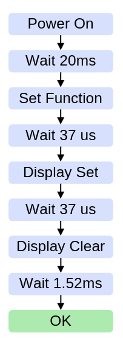

# PMod LCD

## Ziel 
Schreiben einer IP, welche es ermöglicht, das Display soweit wie möglich über Hardware zu steuern. Mögliche Operationen, die hilfreich wären:
- Display löschen
- Zeichen schreiben (an bestimmter Position)
- Cursor setzen (evtl. blinken)
- Text nach links wandern lassen (Lauftext)

## Aufbau

Der PmodCLP besteht aus einem Samsung KS0066 LCD Controller und einem Sunlike LCD Panel, worüber Informationen dargestellt werden können. [1 Functional Descpription]. Die Kernstücke bilden folgende Bausteine innerhalb des LCD controllers: [2.3 CGRAM and DDRAM]

| character-generator ROM (CGROM)     | character-generator RAM (CGRAM)     | data RAM (DDRAM) |
| ----------------------------------- | ----------------------------------- | ---------------- |
| 192 vordefinierte 5x8 Zeichenmuster | 8 vom Nutzer definierte 5x8 Zeichen | 80 Zeichencodes  |

Das DDRAM dient dabei als Indexspeicher für Daten innerhalb des CGROM oder CGRAM. Es wird zwischen erster Zeile (Adresse 00H bis 27H) und zweiter Zeile (Adresse 40H bis 67H) unterschieden.


## Display Specs 
- 16*2 LCD (32 Positionen) a 5x8 Zeichenmuster
- 192 vordefinierte Zeichen inkl. 93 ASCII Charaktere

## LCD Interface 
- DB4-DB7 > Datenbits im Nibble-Mode: hiermit werden Befehle oder Zeichen codiert
- RS > Register Select: High für Daten (Zeichen, Cursor Position), Low für Instruktionen
- RW > Read/Write: High für Read mode, Low for Write Mode
- E > Read/Write: Enable High für Read, falling edge für write

Der character-generator ROM (CGROM) hält eine Tabelle mit Zeichen wird nun ein solcher Index in den display data RAM (DDRAM) geschrieben, wird dieses Zeichen an der entsprechenden Stelle auf dem Display erscheinen. 

Zusätzlich gibt es noch Befehle wie Clear Display und Set DDRAM.

## Display Positionen
Für jede Reihe 39 Slots zur Verfügung (es werden nur 32 benötigt aber die anderen sind z.B. fürs scrollen)

## Startup Sequence
| Flow Chart                       | Beschreibung                                                                                                                                                                                                                                                                                                                      |
| -------------------------------- | --------------------------------------------------------------------------------------------------------------------------------------------------------------------------------------------------------------------------------------------------------------------------------------------------------------------------------- |
|  | <br> <br> <br> <br> <br> <br> <br>  Busbreite, Zeilenanzahl, Zeichenmuster <br> <br> <br> <br> <br> Display anschalten, Cursor an-/ausschalten, Cursor blinken an/aus <br> <br> <br> <br> <br> <br> <br> <br> <br> <br> <br> Entry Mode Set instruction: address increment/decrement und display shift mode an/aus <br> <br> <br> |

Nun können Daten in den DDRAM geschrieben werden, um Infos am Display anzuzeigen.

## Ports am FPGA
Da das Display gemäß Aufgabenstellung im Nible-Mode betrieben werden soll, brauchen wir nur 2 PMod-Header Anschlüsse. Header J1 (Bottom Half) für die Daten-Bits und den Header J2 für die Steuerbefehle.
 ```shell
set_property -dict { PACKAGE_PIN D13   IOSTANDARD LVCMOS33 } [get_ports { clp_db_tri_io[4] }]; #IO_L6N_T0_VREF_15 Sch=ja[7] //db04
 
set_property -dict { PACKAGE_PIN B18   IOSTANDARD LVCMOS33 } [get_ports { clp_db_tri_io[5] }]; #IO_L10P_T1_AD11P_15 Sch=ja[8] //db05

set_property -dict { PACKAGE_PIN A18   IOSTANDARD LVCMOS33 } [get_ports { clp_db_tri_io[6] }]; #IO_L10N_T1_AD11N_15 Sch=ja[9] //db06

set_property -dict { PACKAGE_PIN K16   IOSTANDARD LVCMOS33 } [get_ports { clp_db_tri_io[7] }]; #IO_25_15 Sch=ja[10] //db07

set_property -dict { PACKAGE_PIN E2    IOSTANDARD LVCMOS33 } [get_ports { clp_cb_tri_o[0] }]; #IO_L14P_T2_SRCC_35 Sch=jd[7] //lcd_rs

set_property -dict { PACKAGE_PIN D2    IOSTANDARD LVCMOS33 } [get_ports { clp_cb_tri_o[1] }]; #IO_L14N_T2_SRCC_35 Sch=jd[8] //lcd_rw

set_property -dict { PACKAGE_PIN H2    IOSTANDARD LVCMOS33 } [get_ports { clp_cb_tri_o[2] }]; #IO_L15P_T2_DQS_35 Sch=jd[9] //lcd_e
 ```